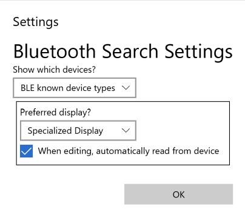

# Settings

Although the Bluetooth Device Controller program is commonly used to directly
control known devices (like the [Nordic Thingy](Nordic_Thingy.md) data collector),
it can also be used for investigating known and unknown Bluetooth devices in your area.
These devices can then be controlled directly through their Bluetooth Service and Characteristics.

# Show which devices
By default, only Bluetooth devices that are known to the program and have specialized
displayed (like for controlling a light bulb) are listed. The *Show which devices* settings
lets you also list show Bluetooth devices where *Device is named* (roughly speaking,
these are devices that your PC has paired with). You can also show *All bluetooth devices*
which will include all nearby Bluetooth devices which are emitting data. You'll often see that
there are a lot of phones that you can detect.

The *Bluetooth COM port* expert setting is for when you need to directly control a "communications port"
type Bluetooth device. 

# BLE Advertisements
When you ask to see Beacons and Advertisements (to see the range of Bluetooth devices in your area),
you can customize the devices you see

When *Full Displays* is checked, you'll see more data about each advertisement
When *Ignore Apple* is checked, advertisements from Apple phones will be supressed.
You can see only closer devices with the Beacon Signal Strength slider. Move the slider to the left (-110) 
to see more devices, and to the right (-40) to see only the closer devices.

# Preferred display
Normally a device with a known specialization (like the [TI_CC1350SensorTag](../Device_TI_1350SensorTag.md)
data device) will show the special page just for it. You can instead view the *Device Editor* page. This will 
show all of the low-level Bluetooth details 

The editor page will also let you create a JSON file that describes the device, and you can generate
C# code to display the device details. These are actually used when I make new speciality pages!